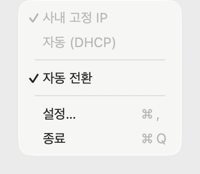

# EXEM Wifi Switcher

사내 Wi-Fi에 접속하면 고정 IP(수동 구성)로, 그 밖의 네트워크에서는 DHCP로 **자동 전환**하는 macOS 메뉴바 앱입니다 (macOS 13 이상).
Wi-Fi 이름(SSID)을 보고 알아서 바꾸며 **전환할 때마다 관리자 암호를 묻지 않습니다.** 터미널 없이 앱 안에서 버튼으로 설치합니다.

<p align="center"><br><sub>설정을 마치면 평소에는 이 메뉴만 보입니다. 지금 어떤 프로필이 적용돼 있는지는 체크 표시로 알 수 있습니다.</sub></p>

## EXEM 사내 전용입니다

- **범용 Wi-Fi 전환 도구가 아닙니다.** 다루는 네트워크는 이름이 **`EXEM` 으로 시작하는 사내 Wi-Fi** 하나뿐이고, 넣어야 하는 값(고정 IP·서브넷 마스크·라우터·사내 DNS)은 **사내에서만 얻을 수 있습니다**
- **그런데도 공개 저장소인 이유.** 이 도구는 `sudoers` 에 **암호 없이 root 로 실행되는 규칙**을 설치합니다. 확인할 수 없는 것을 믿어 달라고 하지 않으려고 [무엇이 어디에 설치되는지](https://github.com/Orchemi/exem-wifi-switcher/wiki/what-gets-installed)와 [설치 버튼이 실제로 실행하는 스크립트](./scripts/install.sh)를 공개해 두었습니다
- **읽은 값을 저장하지 않습니다.** 확인한 Wi-Fi 이름과 위치는 어디에도 저장하지 않고 외부로도 보내지 않습니다

## 이 앱이 요구하는 권한 네 가지

| 권한 | 왜 필요한가요 | 언제 묻나요 |
|---|---|---|
| **전환 권한**<br><sub>암호 없이 실행되는 `sudo` 규칙</sub> | • 전환할 때마다 암호를 묻지 않으려고 미리 등록해 둡니다<br>• 암호 없이 열어 주는 것은 프로필 이름 하나만 받는 스크립트 하나뿐이고, 그 이름도 검증합니다 | 설정 창의 **권한** 항목에서 **[설치]** 를 누를 때 한 번 |
| **설정 저장 권한**<br><sub>관리자 인증</sub> | • 저장한 값이 그대로 전환의 인자가 되므로, 설정 파일을 `root` 소유로 잠급니다 ([잠그는 이유](https://github.com/Orchemi/exem-wifi-switcher/wiki/settings)) | 값을 **[저장]** 할 때마다 |
| **위치 권한** | • macOS는 Wi-Fi 이름(SSID)을 위치 정보로 취급합니다<br>• 이름을 읽지 못하면 여기가 사내인지 알 수 없습니다 | 앱을 **처음 열 때** 한 번. 설정 창보다 먼저입니다 |
| **알림 권한** | • 전환이 일어난 사실을 곧바로 알릴 수 있는 유일한 방법입니다 | 앱이 처음 알림을 보낼 때 |

## 설치

시작하기 전에 세 가지를 확인해 주세요.

- **관리자 계정이 필요합니다.** 전환 권한 설치와 설정 저장이 각각 관리자 인증을 한 번 받습니다. 두 번 모두 **취소하시면 아무것도 바뀌지 않습니다**
- **앱을 처음 열면 위치 권한 창이 먼저 뜹니다.** 설정 창보다 먼저입니다
- **Intel Mac에서 Homebrew가 `/usr/local` 을 소유하고 있으면 설치되지 않습니다.** 설치 스크립트가 그 상태를 감지하고 멈춥니다. 이유는 [한계](https://github.com/Orchemi/exem-wifi-switcher/wiki/limitations) 에 적어 두었습니다 (Apple Silicon은 해당 없습니다)

1. **[Releases](https://github.com/Orchemi/exem-wifi-switcher/releases) 에서 zip을 내려받습니다**
2. 압축을 풀고 `EXEM Wifi Switcher.app` 을 **응용 프로그램** 폴더로 옮깁니다
3. 앱을 엽니다. 처음에는 macOS가 막으므로 아래 접힌 글 **"처음 열 때 macOS가 막습니다"** 의 절차를 한 번 거칩니다
4. 설정 창의 **권한** 항목에서 **[설치]** 를 누릅니다. 무엇을 어디에 설치할지 먼저 보여주고, 확인하면 관리자 암호를 한 번 묻습니다
5. 사내 **Wi-Fi 이름·IP·서브넷 마스크·라우터·DNS 서버** 를 입력하고 저장합니다. 저장할 때 관리자 암호를 **한 번 더** 묻습니다. 이것이 마지막입니다 ([설정하기](https://github.com/Orchemi/exem-wifi-switcher/wiki/settings))

<details>
<summary><b>처음 열 때 macOS가 막습니다</b> (여는 방법은 한 번만 하면 됩니다)</summary>

<br>

앱을 처음 열면 **"확인되지 않은 개발자"** 또는 **"손상되었습니다"** 라는 경고가 뜨고 열리지 않습니다.

**왜 그런가요.** Apple의 유료 개발자 프로그램(연 129,000원)에 가입하지 않아 이 앱을 **공증(notarization)** 받지
못했습니다. 공증이 없으면 macOS는 인터넷에서 내려받은 앱을 일단 막습니다. 앱에 문제가 있어서가 아니라, Apple이
확인해 준 적이 없어서입니다. 숨길 일이 아니라서 그대로 적습니다.

**여는 방법**

1. 앱을 열어 봅니다. 경고가 뜨면 **확인** 을 눌러 닫습니다
2. **시스템 설정 > 개인정보 보호 및 보안** 을 엽니다
3. 아래로 내려 **보안** 항목을 찾습니다. `"EXEM Wifi Switcher"이(가) 차단되었습니다` 같은 문구 옆의 **[그래도 열기]** 또는 **[확인 없이 열기]** 를 누릅니다
4. 앱을 다시 엽니다. 한 번 더 묻는 창에서 **열기** 를 누르면 이후로는 그냥 열립니다

> macOS 15(Sequoia)부터는 **아이콘을 우클릭해 여는 방법으로 넘어가지지 않습니다.** 위의 시스템 설정 경로를 거쳐야 합니다.

**믿고 열어도 되는지 확인하고 싶으시다면.** 이 경고를 없앨 방법이 저희에게 없으므로, 대신 확인할 거리를 둡니다.

- 이 저장소의 코드를 읽습니다. 특히 [`scripts/install.sh`](./scripts/install.sh) 입니다.
  앱의 **[설치]** 버튼이 실행하는 바로 그 파일입니다
- 릴리즈 노트의 **SHA-256** 과 내려받은 파일을 대조합니다: `shasum -a 256 <내려받은 zip>`
- 아예 [직접 빌드](https://github.com/Orchemi/exem-wifi-switcher/wiki/building)합니다. 직접 빌드한 앱은 이 경고가 뜨지 않습니다

터미널로 격리 속성을 지우는 방법(`xattr -d com.apple.quarantine`)도 있지만 권하지 않습니다. 그 명령은 **어떤 앱에도
똑같이 통하기** 때문에 습관이 되기 쉽고, 정작 위험한 앱을 만났을 때도 같은 명령으로 열어 버리게 됩니다.

</details>

## 제거

설정 창 아래 왼쪽의 **[앱 삭제…]** 를 누릅니다. 지울 목록을 먼저 보여주고 관리자 인증을 한 번 받습니다. 설치한 항목을 지운 다음 **앱 자체도 휴지통으로 옮기고 종료합니다.** 휴지통을 비우기 전까지는 되돌릴 수 있습니다. 무엇을 되돌리고 **무엇이 남는지**는 [설치되는 항목 전부](https://github.com/Orchemi/exem-wifi-switcher/wiki/what-gets-installed) 에 있습니다.

<details>
<summary><b>앱이 열리지 않아 [앱 삭제…] 버튼을 누를 수 없다면</b> (터미널)</summary>

<br>

제거 스크립트가 앱 안에 들어 있습니다. 터미널에서 이렇게 부릅니다.

```bash
# 무엇을 지울지 먼저 보기
"/Applications/EXEM Wifi Switcher.app/Contents/Resources/scripts/uninstall.sh" --dry-run

# 실제로 지우기 (필요한 순간에만 sudo 로 승격합니다)
"/Applications/EXEM Wifi Switcher.app/Contents/Resources/scripts/uninstall.sh"
```

앱을 응용 프로그램 폴더가 아닌 곳에 두셨다면 그 경로로 바꿔 부릅니다. **앱까지 지워 버리셨다면** 저장소를 내려받아
`./scripts/uninstall.sh` 를 쓰면 됩니다. 지우는 대상은 모두 앱 밖에 있고, 두 스크립트는 같은 파일입니다.

터미널로 제거하면 **앱 번들과 로그인 항목이 남습니다.** 스크립트가 지우는 것은 앱 밖에 설치한 항목들이고, 앱 자체는
두신 자리에 그대로 있습니다. 직접 휴지통으로 옮겨 주세요. 로그인 항목은 파일이 아니라 macOS 가 관리하는 기록이라
셸에서 끌 방법이 없습니다. 대신 스크립트가 끄는 방법을 안내하고, 앱 번들을 지우면 macOS 가 함께 정리합니다.
앱의 **[앱 삭제…]** 를 쓰면 둘 다 앱이 처리합니다.

</details>

## 더 알아보기

| 하시려는 것 | 읽을 곳 |
|---|---|
| 값을 넣고 저장하고 싶습니다 | [설정하기](https://github.com/Orchemi/exem-wifi-switcher/wiki/settings) |
| 언제 무엇으로 바뀌는지 알고 싶습니다 | [자동 전환](https://github.com/Orchemi/exem-wifi-switcher/wiki/auto-switching) |
| 이 앱이 무엇을 어디에 설치하는지 보고 싶습니다 | [설치되는 항목 전부](https://github.com/Orchemi/exem-wifi-switcher/wiki/what-gets-installed) |
| 무언가 동작하지 않습니다 | [문제 해결](https://github.com/Orchemi/exem-wifi-switcher/wiki/troubleshooting) |
| 소스를 읽고 직접 빌드하고 싶습니다 | [직접 빌드하기](https://github.com/Orchemi/exem-wifi-switcher/wiki/building) |

회사 밖에서 먼저 설치한 경우 · 업데이트 · 한계를 비롯한 나머지 문서는 [Wiki](https://github.com/Orchemi/exem-wifi-switcher/wiki) 에 있고, 이 저장소에 코드를 올리거나 릴리즈를 만드신다면 [커밋·배포 전에 반드시 지켜야 할 것](./RULES.md) 을 먼저 읽어 주세요.

## 문제 신고와 취약점 제보

이 도구는 `sudoers` 에 **암호 없이 root 로 실행되는 규칙**을 설치합니다. 그 규칙이나 권한 스크립트(`apply` · `save-config` · `install.sh`)에서 문제를 찾으셨다면 알려 주세요.

- **창구는 이 저장소의 [Issues](https://github.com/Orchemi/exem-wifi-switcher/issues) 하나입니다**
- 비공개 제보 경로는 두지 않았습니다. 메일 주소를 공개 저장소에 적지 않기 위해서입니다
- Issues 는 누구나 볼 수 있습니다. **사내 IP·라우터·DNS 주소·MAC 같은 값을 붙여넣지 마시고** 문서용 예약 대역(`192.0.2.x`)으로 바꿔 적어 주세요

## 라이선스

[MIT](./LICENSE)
