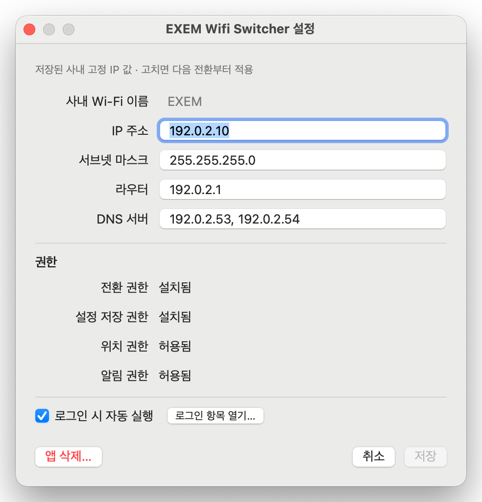

# 설정하기

설정 창의 다섯 칸에 무엇을 넣고, 저장할 때 무슨 일이 일어나는지 적었습니다.

[← README 로 돌아가기](../README.md) · [문서 목록](./index.md)

<p align="center">
  
</p>

<sub>[README 의 설치](../README.md#설치) 4단계와 5단계를 하는 화면입니다. 위쪽 다섯 칸에 사내 값을
넣고, 아래 <b>권한</b> 항목에서 넷이 다 갖춰졌는지(<code>설치됨</code>·<code>허용됨</code>) 확인합니다.
화면에 보이는 주소는 문서용 예약 대역(RFC 5737)이라 실제 값이 아닙니다.</sub>

## 값이 보인다고 저장된 것은 아닙니다

사내에서 설정 창을 열면 앱이 **지금 시스템 구성을 읽어** 칸을 채웁니다. 그 값은 아직 설정 파일에
들어가지 않은 값입니다. **[저장]** 을 눌러야 사내 프로필이 됩니다.

**사내에서 이미 고정 IP를 쓰고 계시다면** 다섯 칸이 모두 채워져 있습니다. 확인하고 **[저장]** 만
누르면 됩니다. 지금 접속한 Wi-Fi 이름까지 함께 채워지므로, 그 한 번으로 자동 전환 준비까지 끝납니다.

회사 밖에서 먼저 설치하셨다면 [지금 할 수 있는 것과 없는 것](./first-setup-outside.md)을 보세요.

창 맨 위 한 줄을 보면 둘 중 어느 쪽인지 알 수 있습니다.

| 머리말 | 뜻 |
|---|---|
| `지금 고정 IP 로 연결됨 · 아직 저장 안 됨 · …` | 지금 구성을 읽어 채운 값입니다. 저장 전입니다 |
| `저장된 사내 고정 IP 값 · 고치면 다음 전환부터 적용` | 설정 파일에 들어 있는 값입니다 |

저장 전에는 메뉴바에도 `초기 설정하기 / - 아직 저장 안 됨` 이 남습니다.

**저장을 놓치지 않도록 다음 두 지점에서 확인합니다.**

- 앱에서 **[설치]** 가 끝나면 `설치했습니다 · 한 걸음 남았습니다` 로 알리고, 그 화면에서 바로 **[값 저장]** 으로
  이어갈 수 있습니다 (저장은 관리자 인증을 한 번 더 받습니다)
- 저장하지 않은 값을 둔 채 창을 닫으면 **[저장하고 닫기]** · **[저장 안 함]** · **[계속 편집]** 을 묻습니다.
  **[취소]** 로 닫을 때는 묻지 않습니다. 버리겠다고 누르신 것이기 때문입니다

## 설정 값과 DNS

고정 IP 프로필에는 **DNS 서버를 최소 하나 적어야 합니다.** 비워 둘 수 없습니다.

DHCP는 IP뿐 아니라 DNS 서버 주소도 함께 알려줍니다. 고정 IP는 그렇지 않습니다.

DNS를 비워 두면 이 도구가 시스템의 DNS 설정을 지우게 되고, 그러면 IP는 연결돼 있는데
**주소가 하나도 열리지 않습니다.** "인터넷이 안 된다"로 보이는 상태입니다.
그래서 빈 DNS는 저장 단계에서 거부합니다.

사내 DNS 서버 주소는 보통 사내에서 DHCP로 연결했을 때의 값과 같습니다.

DNS 서버가 여러 개면 쉼표로 나눕니다 (최대 8개, IPv4만).

### 회사 밖에 다녀오면 사내 DNS 값이 지워집니다

이 도구는 사외로 전환할 때 **수동으로 지정된 DNS를 지웁니다.** 지우지 않으면 사내 DNS 주소를 그대로
쓴 채 집이나 카페 네트워크에 접속하게 되고, 그러면 인터넷 주소가 열리지 않습니다. 의도한 동작입니다.

그래서 사내로 돌아와 설정 창을 열면 DNS 값이 시스템에 남아 있지 않습니다. 값이 없어진 것처럼 보이지만
고장이 아닙니다.

**한 번 저장해 두면 그다음부터는 앱이 채웁니다.** 사내 Wi-Fi에 접속할 때마다 저장된 DNS가 IP와 함께
적용됩니다. 이 도구를 쓰는 이유가 여기에 있습니다.

### 아직 저장 전이라면 앱이 지금 쓰는 값을 제안합니다

수동으로 지정된 DNS가 없을 때는 앱이 **지금 이 기기가 이름 해석에 쓰고 있는 DNS를 읽어** 칸을 채웁니다.
DHCP로 받은 값도 여기에 들어옵니다.

이때는 칸 아래에 그 값이 어디서 왔는지와 **확인하고 저장하시라는 안내**가 함께 나옵니다. 저장된 설정이
아니라 제안이기 때문입니다. 사내 값이 맞는지 보시고 [저장]을 누르시면 됩니다.

`127.` 로 시작하는 주소는 제안에서 뺍니다. 그 기기 안에서만 뜻이 있는 주소라 사내 프로필에 넣으면
다른 곳에서 이름 해석이 끊깁니다.

두 값 모두 읽지 못했을 때는 **빈 칸으로 두지 않고 그 사실을 칸 아래에 적습니다.** 읽지 못한 것을
"없음"으로 오해해 저장하는 일이 없어야 하기 때문입니다.

터미널에서 직접 확인하실 수도 있습니다.

```bash
networksetup -getdnsservers Wi-Fi   # 수동으로 지정된 값 (없으면 "There aren't any DNS Servers set")
scutil --dns | grep nameserver      # 지금 이름 해석에 실제로 쓰이는 값
```

## 저장할 때 관리자 인증을 한 번 받습니다

설정 파일은 `root:wheel 0644` 입니다. 사용자 권한으로는 고칠 수 없습니다.

**왜 잠그는가요.** 이 파일의 `dns`·`router` 값은 암호 없이 실행되는 `apply` 를 통해 그대로 root의
`networksetup` 인자가 됩니다. 파일을 사용자 권한으로 고칠 수 있으면, **암호를 모르는 채 사용자 계정으로
실행되는 코드**(내려받은 앱이나 스크립트)가 시스템 DNS를 공격자 서버로, 기본 게이트웨이를 LAN 안의
다른 기기로 바꿀 수 있습니다.

이 도구를 설치하기 전에는 두 작업 모두 관리자 인증을 요구했습니다. 설치 때문에 그 요구가 사라지면 안 됩니다.

- **저장할 때만** 인증 창이 뜹니다. 처음 설정할 때와 값을 바꿀 때뿐이라 실질적으로 몇 번 되지 않습니다
- **전환할 때는 묻지 않습니다.** 이 도구의 존재 이유가 거기에 있습니다
- 인증을 취소하면 **저장되지 않고 이전 설정이 그대로 남습니다.** 그 사실과 함께,
  터미널에서 이어서 저장할 명령이 창에 표시됩니다
- **관리자 계정이 아니면 저장할 수 없습니다.** 인증 창을 띄우기 전에 알려 줍니다

저장을 처리하는 스크립트(`save-config`)는 **`sudoers` 에 넣지 않습니다.** 넣으면 파일을 잠근 의미가
사라집니다. 설치 스크립트가 마지막에 이 조건을 확인해 보여 줍니다.

## 로그인 시 자동 실행

설정 창 맨 아래 체크상자로 켜고 끕니다. 켜면 **시스템 설정 > 일반 > 로그인 항목 및 확장 프로그램** 의
위쪽 **"로그인 시 열기"** 목록에 `EXEM Wifi Switcher` 로 나타납니다.

켜고 끄는 최종 권한은 macOS에 있습니다. 시스템 설정에서 이 항목을 끄면 로그인해도 뜨지 않고,
그때는 체크상자 아래에 **"macOS 가 이 항목을 꺼 두었습니다"** 가 남습니다.
